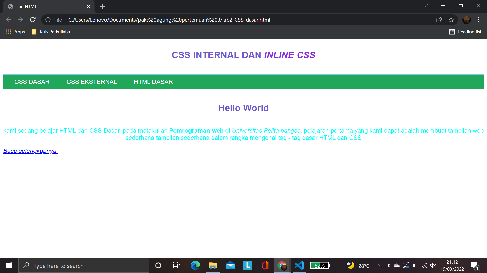
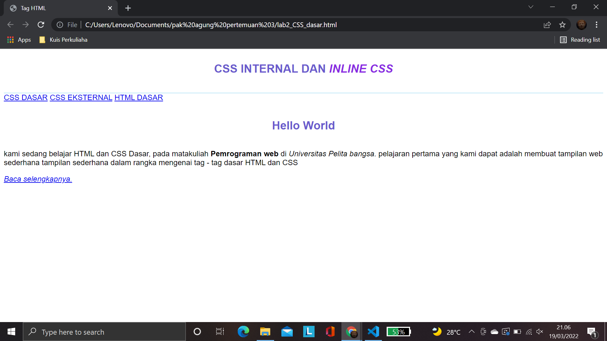
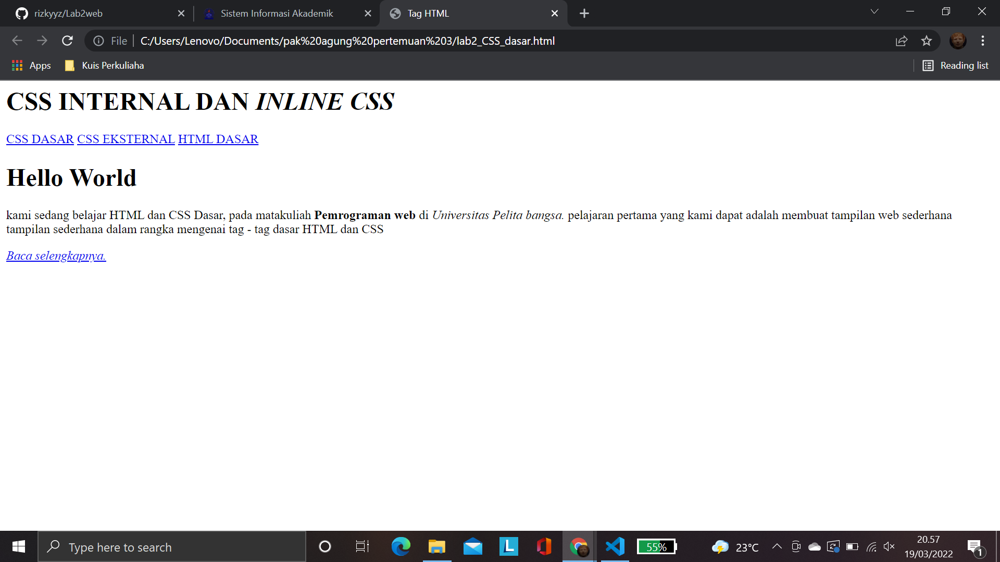
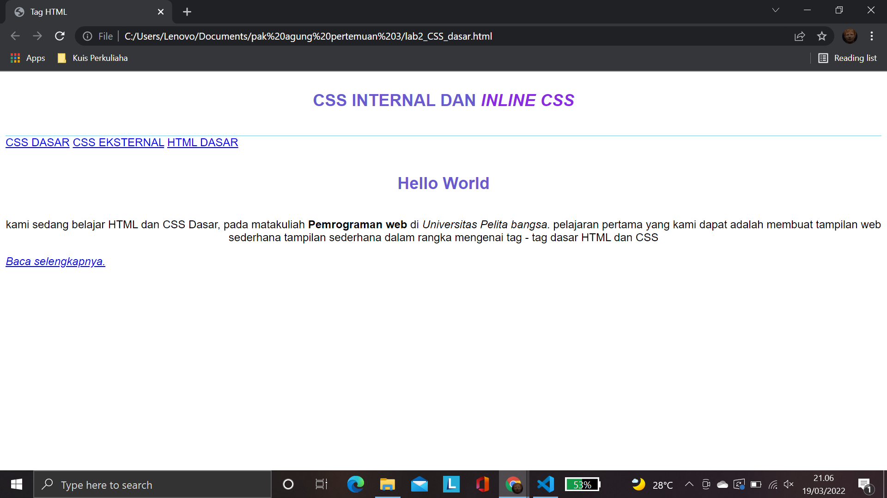
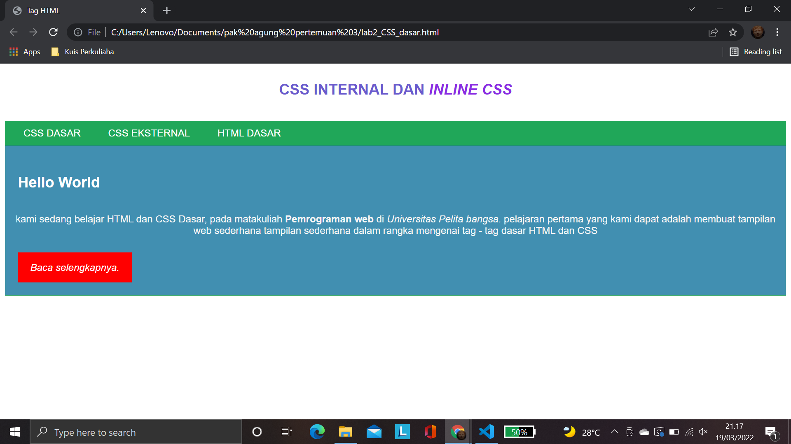

# Tugas LAB 2 Web
## Profil
| # | Biodata |
| -------- | --- |
| *Nama* | Muhammad Ikwanur Dimas Fauzi |
| *NIM* | 312010388 |
| *Kelas* | TI.20.A.2 |
| *Mata Kuliah* | Pemrograman Web |

## 1. Membuat Dokumen HTML
* Buka VS Code dan buat file HTML baru. Setelah itu buat struktur HTML 

```<!DOCTYPE html>
<html>
    <head>
        <meta charset="utf-8">
        <meta lang="en">
        <meta name="viewport" content="width=device-width, initial-scale=1.0">
        <link rel="stylesheet" href="style.css">
        <title>
                Tag HTML
        </title>
    </head>
    <body>
        <!--Menggunakan Header-->
        <header>
            <h1>CSS INTERNAL DAN <i>INLINE CSS</i></h1>
        </header>
        <nav>
           <a href="#">CSS DASAR</a>
           <a href="#">CSS EKSTERNAL</a>
           <a href="#">HTML DASAR</a>
        </nav>
        <div id="intro">
            <h1>Hello World</h1>
            <!--Menambahkan Inline Css Pada Paragraf-->
            <p>kami sedang belajar HTML dan CSS Dasar, pada matakuliah <b>Pemrograman
             web</b> di <i>Universitas Pelita bangsa.</i> pelajaran pertama yang kami dapat 
             adalah membuat tampilan web sederhana tampilan sederhana dalam rangka mengenai tag - tag dasar HTML 
             dan CSS</p>
            <a class="button btn-primary" href="#intro"><i>Baca selengkapnya.</i></a>
        </div>
    </body>
</html>

```

* Maka hasilnya akan seperti berikut.


## 2. Mendeklarasikan CSS Internal
* kemudian tambahkan deklarasi CSS Internal di dalam html seperti berikut pada bagian head.
<!-- Ini adalah paragraf pertama -->
```
<head> 
        <style>
            body {
                 font-family: 'Open Sans', sans-serif;
                 }
            header {
                 min-height: 80px;
                 border-bottom: 1px solid #77ccef;
                 }
            h1 {
                 font-size: 24px;
                 color: slateblue;
                 text-align: center;
                 padding: 20px 10px;
            }
            h1 i {
                 color:blueviolet;
                 }
        </style>
    </head>
```

* model Praktikum pemrograman web Maka hasilnya akan seperti berikut.


## 3. Menambahkan Inline CSS
* Menambahkan Inline CSS
  Kemudian tambahkan deklarasi inline CSS pada tag <p>
```
<p style="text-align: center; color: cc8e4;>
```

## 4. Membuat CSS Eksternal
* Membuat CSS Eksternal dengan membuat file baru dengan nama style_eksternal.css kemudian buat deklarasi css seperti berikut ini.
```
nav {
    background: #20a759;
    padding: 10px;
    color: #fff;
}
nav a {
    color: #fff;
    text-decoration: none;
    padding: 10px 20px;
}
nav .active,
nav a:hover {
    background: #0b6b3a;
}
```
* kemudian tambah tag <link> untuk merujuk file css yang sudah di buat pada bagian <head>

```
<head>
    <!--menyisipkan css eksternal-->
    <link rel="stylesheet" href="style_eksternal.css" type="text/css">
</head>
``` 
* selanjutnya refresh kembali pada browser unutk melihat perubahan menjadi seperti ini

## 5. Menambahkan CSS Selector
* selanjutnya menambahkan CSS Selector menggunkan ID dan class Selector pada file style_eksternal.css dan menambahkan kode seperti berikut 
```
/* Menambahkan ID SELCTOR */
#intro {
    background: #418fb1;
    border: 1px solid #099249;
    min-height: 100px;
    padding: 10px;
}
#intro h1 {
    text-align: left;
    border: 0;
    color:#fff;
}

/* Menambahkan Class Selector */
.button {
    padding: 15px 20px;
    background: #bebcbd;
    color: #fff;
    display: inline-block;
    margin: 10px;
    text-decoration: none;
}
button .active
button:hover{
    background: #fff;
}
.btn-primary {
    background: red;
}
.btn-primary:hover{
    animation-duration: 10ms;
    background: #099249;
}
```

* Maka hasilnya setelah di refresh seperti berikut.


